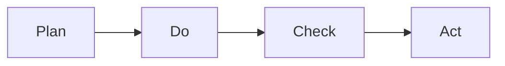
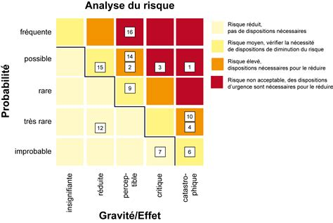
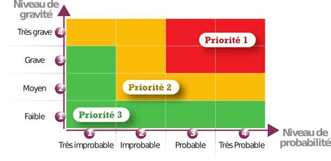

# IDG
Présentation d'OPENIG 
Occitanie Pyrenees en Intelligence Geographique. C'est une initiative regionale pour promouvoir l'usage des données geographiques et des technologies associées ou CRIGE. 

#### - Comment deployer une solution de catalogage ?

## Infrastructure de données géographiques
Permet de recenser, stocker, gérer et partager des données géographiques via un ensemble de services (catalogues, serveurs, logiciel, données, applications , page web).

Peut dépendre de normes et de standards. Il est mis en oeuvre en suivant les loi ***CADA***, ***PSI***, ***INSPIRE***, etc.
Une IDG peut être généraliste, territoriale ou thématique. (urba, risques, la santé, etc.)

L'IDG a vocation à évoluer vers une plateforme de données géographiques puis vers une plateforme territoriale de donnees via l'OPENDATA.


Exemples d'IDG :

| IDG                       |     |
| ---------------------------| -----|
| Service de recherche      |     |
| Service de consultation   |     |
| Service de téléchargement |     |
| Service de transformation |     |
| Service d'appels          |     |

#### Enjeu interopérabilité
Le systeme de coordonnées utilisé en Opendata est le lambert93 WGS84.
L'interopérabilité concerne les champs ***sémantique, géographique et informatique***.

Les 4 principes **FAIR**
- **F**indable : Les données doivent être facilement trouvables
- **A**ccessible : Les données doivent être facilement accessibles (ou expliquées)
- **I**nteroperable : Les données doivent être interoperables (intégration, applications).
- **R**eusable : Les données doivent être réutilisables.

Sémantique:
Mise en place de standards, plusieurs referentiels en cours de definition.

Géographique: 

Informatique:

#### Solutions de diffusion de données geospatiales :

| Nom                     |     |
| -------------------------| -----|
| Prodige                  |     |
| Geoorchestra            |     |
| Isogeo                   |     |
| IDGEO                    |     |
| OneGeoSuite              |     |

#### Solutions de diffusion de données non geospatiales :


| Nom                   |     |
| -----------------------| -----|
| Dataverse             |     |
| Ckan                  |     |
| Udata                 |     |
| Opendatasoft = huwise |     |
| Koumoul               |     |

### Différentes approches :

| Type           | Avantges                 | Inconvénients                                                                                        |     |
| ----------------| --------------------------| ------------------------------------------------------------------------------------------------------| -----|
| **SAAS**       | Tranquilité              | Cout<br>Dépendance<br>CCTP<br>Evolution limitée                                                      |     |
| **Hybride**    | Indépendance d'évolution | connaissances techniques, dépendance aux outils                                                      |     |
| **Auto-gérée** | Maîtrise technique       | Coûts de développement, maintenance et de sécurité, nécessite un poste dédié, documentation, support |     |
 

## Auto-gérée
- internalisation de l'hebergement

- delegation de l'hebergement à un prestataire
  
### Le SI:

il faut choisir les outils qui vont bien, OS, serveurs, prestataires externes ? 

Structuration, cartographie (architecture réseaux), **<span style="color:red">DOCUMENTATION</span>**, évolution (sécurisation), veille.

Gérer les accès, les droits, les utilisateurs.

Pour cela il faut appliquer le cycle PDCA :




#### Analyse des risques :

**probabilité * impact**

##### Identification des risques et évaluation

Risques :
- Panne
- Piratage
- Coupure réseau

<br>

<div style="text-align: center;"></div>


#### Tableau des probabilités/impacts :

| Probabilités        | Très faible    | Faible    | Moyenne     | Élevée     | Très élevée     |
| ---------------------| ----------------| -----------| -------------| ------------| -----------------|
| **Impacts/Gravité** | **Très élevé** | **Élevé** | **Moyenne** | **Faible** | **Très faible** |

#### Tableau de risques :


<div style="text-align: center;"></div>

<br>

### Contexte chez openIG

2017 erogonoimie mal adapté >
2018 reaffirmation des besoins >
2019 AMO DATAKODE pour definition des contours du projet 

#### Phase 1 : Diagnostic
5 besoins principaux :
- Produire
- Rechercher
- Commander
- Informer

Identification des personas

#### Phase 2 : Scénarii et feuille de route
5 scénarios mis en relation avec les personas. Permet de couvrir les besoins identifiés. 

#### Outils sélectionnés

mviewer pour la visualisation des données.

Géocontrib pour la contribution collaborative.

#### Maintenance corrective et évolutive
Optimisation VM, revision capacité stockage, MAJ des outils

---
Fin 2024, 22 structures utilisatrices pour 345 jeux de données.


Retex:
optimisation des briques opensources (Pgadmin, Postgis, GeoServer, Qgis server, etc.) pas de documentation pour chaque outils. Pas de possibilité de support technique pour toutes.
Abandon de IDGO par l'hébergeur.

Actions du GT : Migration sur la nouvelle solution, refonte du CMS (Content Management System, exemple : Wordpress).

#### 2025: 
Emergences d'outils nationaux comme Geoplateforme et datagouv
Données territoriales
IA
Common European Data Space

<br>

**HS:** idée de projet 
```
Un site internet,
un site carto / dataviz,
une bibliothèque de données avec recherche IA,
un wiki,
un forum,
un site de contribution.

