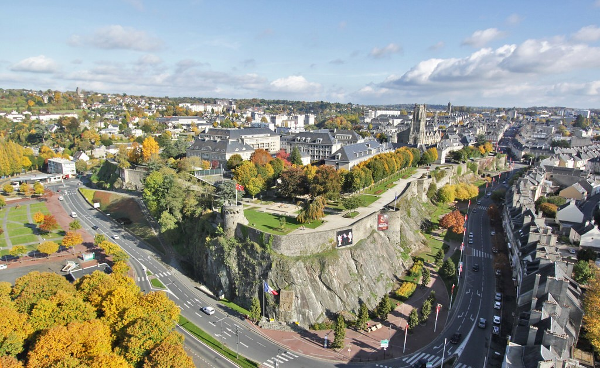

# Sources de données 

## Saint-Lô Agglo 

[saint-lo-agglo.fr](https://www.saint-lo-agglo.fr/fr/annuaire-g%C3%A9n%C3%A9ral/carte)

La belle ville de Saint-Lo se trouve en Normandie, dans le département de la Manche.

# 🗂 Sources de Données

### - 📄 Données papiers

 

# 🗺 
## Données SIG — Internes

 

### - PLUi

 

### - Données brutes terrains

| Format    |
| -----------|
| `AutoCAD` |
| `.shp`    |
| `.gpkg`   |
| `papier`  |

 

### - Base de données PostgreSQL

| Table / Vue       |
| -------------------|
| `troncon_eau`     |
| `compteurs`       |
| `vm_alerte_fuite` |

 

---

 

## 🌐 Données SIG — Externes

| Source            | Format     |
| -------------------| ------------|
| BD Ortho IGN      | WMS / WMTS |
| BD Topo IGN       | WMS / WMTS |
| Cadastre          | bdd        |
| Données Régie Eau | csv        |

 

  

<html>
<head>
  <meta charset="utf-8">
  <title>Carte ortho IGN</title>

  <!-- Leaflet CSS -->
  <link
    rel="stylesheet"
    href="https://unpkg.com/leaflet@1.9.4/dist/leaflet.css"
  />
  
</head>
<body>

<h2>Saint-Lô Agglo</h2>

<!-- Leaflet JS -->

</body>
</html>

