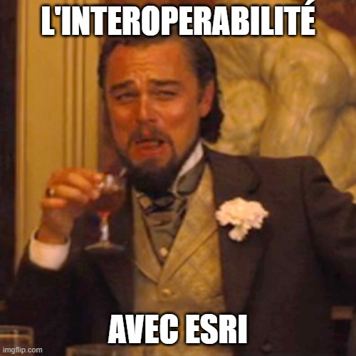
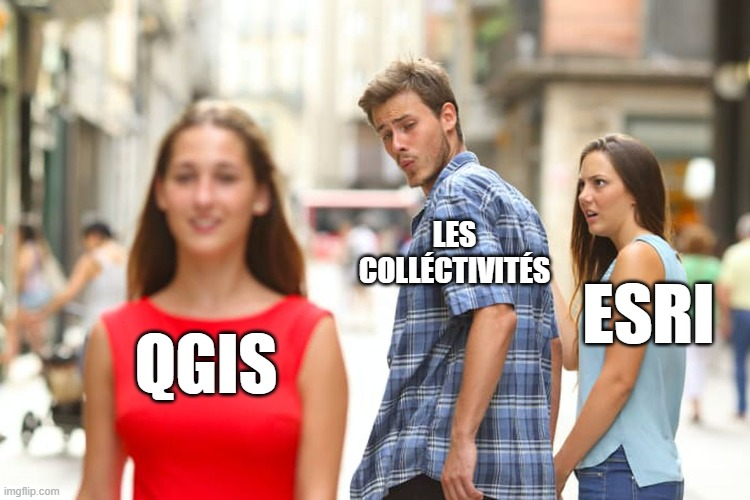
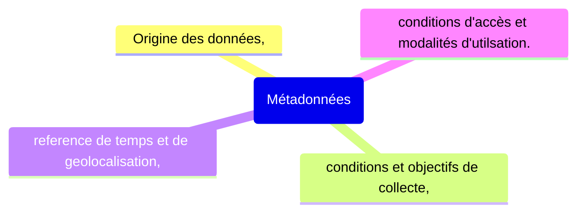
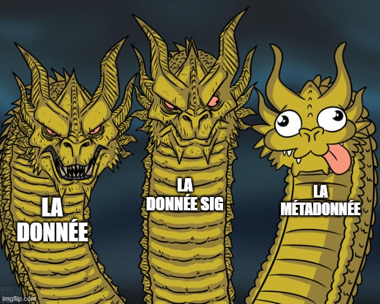

<h1 style="text-align: center; color: #007acc;">Métadonnées et interopérabilité</h1>

## 🔄 Interopérabilité

 

Comprendre l'importance de l'interopérabilité entre les différents systèmes et formats de données.

 

### Qu'est ce que l'interopérabilité ?
  systeme capable de fonctionner avec d'autres systemes
  compatibilité entre les différents systèmes et formats de données
  
  Exemples :
  - formats AutoCAD vs SIG
  - GML 
  - xml = format ouvert, standardisé
  - gpkg 
  
### Les enjeux de l'interopérabilité :
  - partage de données entre différents systèmes
  - standardisation des formats de données
  - compatibilité entre les différents systèmes et formats de données

 

Standards :
Open Geospatial Consortium (OGC) est une organisation qui développe des standards pour la géomatique.

Le site de l'OGC : [https://www.ogc.org/](https://www.ogc.org/)

il regroupe les formats de données géospatiales les plus utilisés dans le domaine de la géomatique. Avec un standard unique pour tous les formats de données géospatiales.

 

### Directives et recommandations :

- INSPIRE : lien vers la directive [https://www.legifrance.gouv.fr/codes/article_lc/LEGIARTI000033299453](https://www.legifrance.gouv.fr/codes/article_lc/LEGIARTI000033299453)
- EU-OSPS : lien vers la recommandation [https://eur-lex.europa.eu/legal-content/FR/TXT/?uri=CELEX:32023H1284](https://eur-lex.europa.eu/legal-content/FR/TXT/?uri=CELEX:32023H1284)

### Les normes :

ISO 19115 : métadonnées
ISO 19119 : services géographiques
ISO 19139 : XML

 

#### Processus d'élaboration des métadonnées :
           1. proposition
           2. preparation
           3. qualification
           4. enquête
           5. publication
 

 

### FAIR / TAIR
Findable, Accessible, Interoperable, Reusable
Trouvable, Accessible, Interopérable, Réutilisable

 

Les web services géographiques
protocoles http, https, ftp, etc.
fonctionnent sur des serveurs web cartographiques directement lus par les navigateurs web.

Parmi les standards les plus utilisés :
- WMS (Web Map Service)
- WFS (Web Feature Service)
- WMTS (Web Map Tile Service)
- WCS (Web Coverage Service)
- WPS (Web Processing Service)
- CSW (Catalogue Service for the Web)

les formats locaux :
- SLD
- GPKP
- WKT CRS
- KML
- GML

 

WMS vs WMTS , la différence principale est que WMS retourne des images tandis que WMTS retourne des tuiles précalculées.

TMS (Tile Map Service) est un standard qui permet de servir des tuiles précalculées. Il est plus rapide que WMS car les tuiles sont déjà générées et stockées sur le serveur.

## 📋 Métadonnées
 

### les catalogues et les métadonnées

<h1 style="color: red;"># SPOILER ALERT ! </h1>
<h3>CA VA NOUS OCCUPER PENDANT PLUSIEURS ANNÉES !</h3>

Les ETL (Extract, Transform, Load) sont des processus qui permettent de transformer des données d'un format à un autre.
Ils sont utilisés pour extraire des données d'une source, les transformer et les charger dans une destination.

Les ETL sont utilisés pour :
- transformer des données d'un format à un autre
- extraire des données d'une source
- charger des données dans une destination
- normaliser des données
- harmoniser des données
- etc.

Les formats de données :
- Vecteur
- Raster:
  - aérien
  - satellite
  - lidar
  - drone
  - etc.

## Enjeux  des metadonnees :

Qu'est ce que les metadonnees ?
- Données liées a une autre données. ex : une photo avec des coordonnées GPS, une date, une description, etc.
Elle peut etre une description des données attendues dans les champs d'une table attributaire.
 
 

 

Interet des metadonnées :
- facilite la recherche et la localisation des données
- permet de comprendre le contexte et l'origine des données, comment elle a été produite ?
- facilite la gestion des droits d'accès et de protection des données

Le but est donc de créer un catalogue de données avec des métadonnées en accord avec les normes **ISO 19115** et **ISO 19119**.

 

## Standards des metadonnées :
- **ISO 19115** : métadonnées, publié en 2003 et adapté par l'union européenne en 2007 pour créer la norme Inspire.

- **ISO 19119** : services géographiques

- **DCAT** : interoperabilité des données catalogues et données web
  - version GEODECAT : https://doc.data.gouv.fr/moissonnage/dcat/
  
- **RDF** : Resource Description Framework, le but est de permettre la description des données dans un format standardisé.

- **CNIG** : Centre National d'Information Géolocalisée travail sur les metadonnees.
 [cnig.fr/](https://cnig.gouv.fr/gt-metadonnees-a958.html)

## Quelle forme pour les metadonnees ?

| IDENTIFICATION DES RESSOURCES  |
| --------------------------------|
| titre                          |
| résumé                         |
| mot-clé (référentiels inspire) |

| VERSION             |
| ---------------------|
| Date de publication |
| Date de mise à jour |

| QUALITE                              |
| --------------------------------------|
| mesures, précision                   |
| généalogie : auteur, processus, etc. |

Régles de mise en œuvre :
Identifications
classifications et services géographiques 

[Guide de saisie des éléments de metadonnees inspire](https://cnig.gouv.fr/IMG/pdf/guide-de-saisie-des-elements-de-metadonnees-inspire-v2.0-allege.pdf)

### Contraintes d'utilisation :
Conditions d'accès et d'utilisation
Restriction concernant le public

Outils de cataloguages :
- **GeoNetwork**
- **CKAN** 
