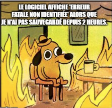
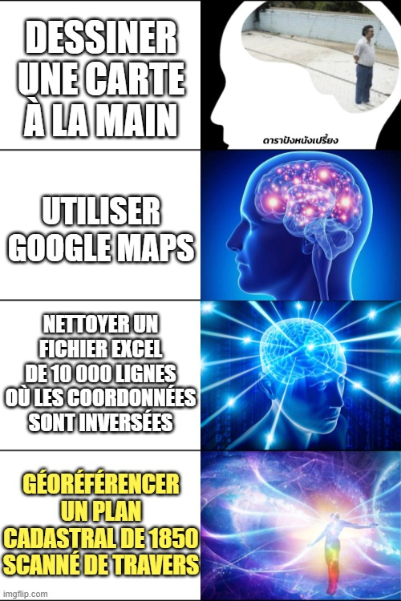

<h1 style="text-align: center; color: #007acc;">La Memologie</h1>

## L'Art du MEME 

 

---

 

## 📖 L'Histoire Fascinante des MEME

 

### 🌅 Les Origines Anciennes

Avant Internet, les mèmes existaient déjà sous forme de **culture populaire** transmis de génération en génération :

- **Contes et légendes** racontés autour du feu
- **Blagues et expressions** populaires dans les villages  
- **Chansons folkloriques** qui traversaient les époques
- **Images récurrentes** dans l'art et la littérature

 

---

 

### 🚀 L'Ère Digitale : Naissance du Mème Moderne

#### **1996 : Le Premier Mème Internet**
Le terme "mème" est popularisé par **Richard Dawkins** dans son livre "The Selfish Gene" (1976), mais c'est avec Internet que le concept explose.

#### **Années 2000 : L'Âge d'Or**
- **Dancing Baby** (1996) : Premier véritable mème viral
- **All Your Base Are Belong To Us** (2001) : Premier mème gaming
- **LOLcats** (2006) : Les chats prennent le contrôle d'Internet
- **Rickroll** (2007) : L'art de la surprise

 

---

 

### 🎨 Les Grandes Familles de Mèmes

 

#### 😂 **Les Mèmes Humoristiques**
- **Distracted Boyfriend** : Les dilemmes modernes
- **Woman Yelling at a Cat** : Les confrontations épiques
- **Two Buttons** : Les choix impossibles de la vie

 

#### 🧠 **Les Mèmes Intellectuels**
- **Expanding Brain** : L'évolution de la pensée
- **Galaxy Brain** : Quand les idées deviennent cosmiques
- **Drake Hotline Bling** : Les préférences et rejets

 

#### 💼 **Les Mèmes Professionnels**
- **This is Fine** : Le bureau en feu
- **Success Kid** : Les petites victoires
- **Hide the Pain Harold** : Le sourire face à l'adversité

 

---

 

### 🌍 L'Impact Culturel Global

 

#### **Un Langage Universel**
Les mèmes ont créé une **nouvelle forme de communication** qui transcende les frontières :

- 🌐 **Instantanément compréhensible** partout dans le monde
- 📱 **Adapté aux réseaux sociaux** et à la communication rapide
- 🎭 **Expression d'émotions complexes** en une seule image
- 🤝 **Créateur de liens** entre générations et cultures

 

#### **Le Pouvoir Politique**
Les mèmes sont devenus des **outils d'influence** :

- **Campagnes de sensibilisation** qui deviennent virales
- **Satire politique** accessible à tous
- **Mobilisation citoyenne** par l'humour
- **Désinformation** et son combat

 

---

 

### 🔮 L'Avenir de la MEMologie

 

#### **L'Ère de l'IA**
Avec l'intelligence artificielle, nous entrons dans une nouvelle ère :

- **Mèmes générés par IA** : Création infinie et personnalisée
- **Mèmes interactifs** : Qui s'adaptent à chaque utilisateur
- **Mèmes 3D/VR** : Expériences immersives
- **Mèmes intelligents** : Qui comprennent le contexte

 

#### **La Méméconomie**
L'économie des mèmes devient réalité :

- **Créateurs professionnels** de mèmes
- **Marketing par mème** : La nouvelle publicité
- **Plateformes monétisées** de partage de mèmes
- **Droits d'auteur** et propriété intellectuelle

 

---

 

### 🎯 Pourquoi la MEMologie est Importante

 

La MEMologie n'est pas juste une question d'humour. C'est :

- **🧠 Psychologie sociale** : Comment les idées se propagent
- **📊 Anthropologie moderne** : Étude des comportements collectifs
- **💬 Linguistique visuelle** : Nouvelle forme de langage
- **🔄 Sociologie numérique** : Comment nous connectons et partageons

 

---

 

### 📚 Les Leçons de la MEMologie

 

1. **Simplicité** : Les meilleures idées sont les plus simples
2. **Universalité** : Ce qui nous touche nous touche tous
3. **Adaptabilité** : Les mèmes évoluent avec le temps
4. **Communauté** : Rien n'existe sans partage

 

---

 

## 🎭 Conclusion : Plus qu'un Simple Phénomène

La MEMologie représente **l'évolution naturelle de la communication humaine** à l'ère numérique. C'est le reflet de notre société, de nos angoisses, de nos joies et de notre capacité collective à trouver de l'humour même dans les situations les plus complexes.

 

> *"Un mème vaut mille mots, et une communauté de mèmes vaut une révolution."*

 

---

 

🎭 La MEMologie continue d'écrire son histoire... un mème à la fois 🎭

 

---

 

## 🗺️ Les Mèmes Cartographiques : Quand la Géomatique Devient Virale

 

### 🌍 L'Humour SIG qui Fait le Tour du Monde

 

#### **"Here Be Dragons" 🐉**
Le mème cartographique le plus ancien ! Sur les cartes médiévales, les zones inconnues étaient marquées *"Hic sunt dracones"* (Ici il y a des dragons).

 

#### **"Flat Earth Society" 🌍➡️📐**
Les mèmes sur les terre-platistes qui utilisent des projections cartographiques pour "prouver" leurs théories :

- **Projection de Mercator** : "Regardez, l'Antarctique entoure tout !"
- **Projection de Peters** : "Les proportions sont fausses !"
- **Globe vs Map** : Le débat éternel

 

#### **"GIS Analyst Problems" 💻🗺️**
Les mèmes que seuls les géomaticiens comprennent vraiment :

- **"My coordinate system is wrong"** : La panique du SIGiste
- **"Projection mismatch"** : Quand les couches ne s'alignent pas
- **"Buffer distance"** : Les débats sans fin sur les distances de tampon
- **"Attribute table"** : Quand Excel devient votre meilleur ennemi

 

---

 

### 📱 Les Mèmes des Réseaux Sociaux Géospatiaux

 

#### **"Google Street View Fails" 🚗📸**
Les captures d'écran hilarantes de Google Street View :

- **Personnages inattendus** : Animaux, costumes, situations absurdes
- **Glitches technologiques** : Voitures flottantes, bâtiments déformés
- **Moments intimes** : Capturés au mauvais moment

 

#### **"Map Porn vs Map Shaming" 🌍😍😂**
Les deux faces de la cartographie sur Reddit :

- **Map Porn** : Cartes magnifiques, design incroyable
- **Map Shaming** : Pires erreurs cartographiques, projections horribles

 

#### **"What Three Words" 📍📝**
Les mèmes sur l'application de géolocalisation :

- **Adresses absurdes** : ///trottoir.pain.ordinateur
- **Situations ironiques** ///perdu.mais.pas.trop
- **Traductions automatiques** : Les résultats surprenants

 

---

 

### 🎓 Les Mèmes Académiques en Géomatique

 

#### **"Thesis Defense" 🎓🗺️**
Les mèmes sur la soutenance de thèse en géomatique :

- **"My data is clean"** : Le mensonge le plus courant
- **"Statistical significance"** : p < 0.05, la magie opère
- **"Future work"** : La section la plus longue de toute thèse

 

#### **"Conference Problems" ✈️📊**
Les mèmes des conférences géospatiales :

- **"Poster session"** : 10 personnes pour 50 posters
- **"Network error"** : Le WiFi qui lâche pendant votre présentation
- **"Free coffee"** : La vraie raison de votre présence

 

---

 

### 🛰️ Les Mèmes Technologies Géospatiales

 

#### **"GPS Issues" 🛰️📱**
Quand la technologie nous joue des tours :

- **"GPS accuracy"** : "Je suis à 3 mètres... de l'océan"
- **"Signal lost"** : Dans les endroits les plus inattendus
- **"Battery died"** : Au milieu de nulle part

 

#### **"Drone Mapping" 🚁📸**
Les mèmes sur la cartographie par drone :

- **"No-fly zones"** : Les restrictions partout
- **"Weather conditions"** : Le vent qui ruiné tout
- **"Processing time"** : Des heures pour quelques minutes de vol

 

---

 

### 🎯 Pourquoi les Mèmes Cartographiques Fonctionnent

 

Les mèmes géospatiaux sont spéciaux car ils combinent :

- **🧠 Connaissance technique** : Seuls les initiés comprennent vraiment
- **🌍 Universalité** : Tout le monde utilise des cartes
- **😂 Absurdité** : Les situations SIG sont souvent ridicules
- **🤝 Communauté** : Crée des liens entre professionnels du monde entier

 

---

 

### 🔮 L'Avenir des Mèmes Géomatiques

 

Avec les nouvelles technologies, de nouveaux mèmes apparaissent :

- **🤖 IA générative** : Cartes créées par IA qui deviennent des mèmes
- **🥽 Réalité augmentée** : Overlays absurdes dans le monde réel
- **🌐 Métavers** : Cartes de mondes virtuels qui deviennent virales
- **🛰️ Satellite imagery** : Images satellite surprenantes qui deviennent des mèmes

 

---

 

🗺️ La cartographie rencontre la culture populaire... et ça devient viral ! 🗺️

