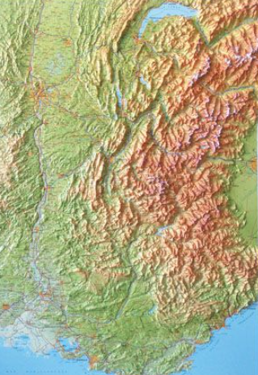
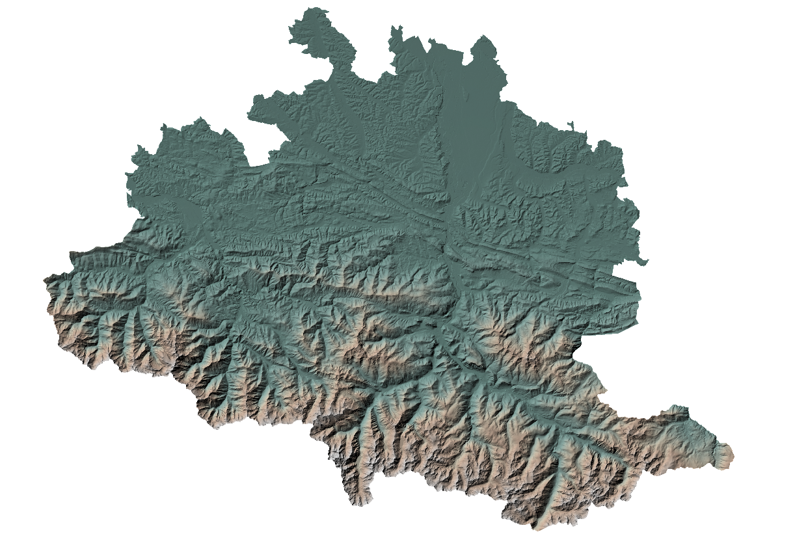
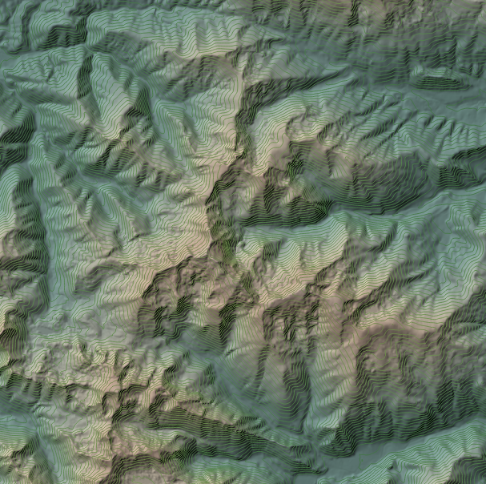

OGR 

Aprés installation d'OGR et GDAL, installer ogrinfo, ogr2ogr 

tips = 
 + ctrl + espace + le type de code 

```sql
select * 
from 
```


## Installer postgresql-client
(attention a la version de postgresql-client)

```bash
sudo apt install postgresql-client
```


## connecter a la base psql :
```bash
idgeo@GS2:/mnt/d/git/cli$ psql -h nom de la base -p port -U user -d schema
Password for user editeur:

spiderman=> \d
             List of relations
 Schema |       Name        | Type  | Owner
--------+-------------------+-------+-------
 public | geography_columns | view  | admin
 public | geometry_columns  | view  | admin
 public | spatial_ref_sys   | table | admin
(3 rows)
```

faire un appel a la table dans commande : (ne pas oublier le "**;**")
```sql
 select * from address.address;
```

# GDAL = Geospatial Data Abstraction Library

[github gdal](https://github.com/OSGeo/gdal)

[gdal.org/](https://gdal.org/)

Créer un fichier de metadonnées :

exemple : INFO: Open of `departements-20180101.shp'
      using driver `ESRI Shapefile' successful.
INFO: Open of `departements-20180101.shp'
      using driver `ESRI Shapefile' successful.
1: departements-20180101 (Polygon)


```bash
ogrinfo -so departements-20180101.shp >> def_dept.txt
```

créer un shape a partir d'un autre 
```sql
ogr2ogr -where "code_insee='14'" 14.shp departements-20180101.shp
```


découper un raster avec un shape
```bash
gdalwarp -overwrite -s_srs EPSG:2154 -t_srs EPSG:2154 -of VRT -cutline 14.shp -cl 14 ../raster/mnt/mnt31.vrt ../raster/mnt/mnt31_decoup.vrt
```

découper un raster avec un shape et un filtre
```bash
gdalwarp -s_srs EPSG:2154 -t_srs EPSG:2154 -of VRT -cutline vecteur/COMMUNE.shp -cl COMMUNE -cwhere "INSEE_COM='31'" -crop_to_cutline raster/mnt/mnt31_decoup.vrt raster/mnt/mnt31_decoup_toulouse2.vrt
```


convertir un vrt en tif
```bash
gdal_translate -of GTiff raster/mnt/mnt31_decoup_toulouse2.vrt raster/mnt/mnt31_decoup_toulouse2.tif
```

créer des courbes de niveau avec la BD Alti
```bash
gdalcontour -a elev raster/mnt/mnt31_decoup_toulouse.vrt vecteur/contour_mnt_.shp -i 5
```

créer un ombrage
```bash
gdaldem hillshade raster/mnt/mnt31.vrt raster/mnt/ombrage.tif
```

Coloré le raster avec une palette :

Créer un fichier color.txt avec les couleurs voulu en RVB 

```bash
gdaldem color-relief raster/mnt/mnt31.vrt color.txt raster/mnt/relief_color.txt
```




# SCRIPTS

## Objectif créer un fichier de script où s'enchaine plusieurs commandes
script bash avec extension .sh 
```bash
#!/bin/bash
mkdir mon_dossier

echo "dossier créé"

echo "j'écris dans le fichier" >> mon_dossier/readme.md

echo "fin du script, BG"


```
il doit etre executable

extraire un departement de la geoplateforme avec ogr2ogr
```bash
ogr2ogr -of "PostgreSQL" PG:"dbname=spiderman user=editeur host=192.168.10.1 port=15432 password=editeur2026" -nln public.calvados -s_srs EPSG:4326 -t_srs EPSG:2154 WFS:https://data.geopf.fr/wfs/ows?SERVICE=WFS BDTOPO_V3:departement -where "code_insee='14'"
```

Automatiser un script 
Etape par etape:
```bash
#- créer un dossier calvados 
mkdir calvados

#- créer un dossier mnt 
mkdir mnt

#- telecharger la BDALTI 25m dans le dossier mnt (format .zip) 
wget -p https://data.geopf.fr/telechargement/download/BDALTI/BDALTIV2_2-0_25M_ASC_LAMB93-IGN69_D014_2022-12-21/BDALTIV2_2-0_25M_ASC_LAMB93-IGN69_D014_2022-12-21.7z

#- decompresser le fichier
7z x data.geopf.fr/telechargement/download/BDALTI/BDALTIV2_2-0_25M_ASC_LAMB93-IGN69_D014_2022-12-21

#-mettre au format tif
gdal_merge.py -o mnt/ariege.tif BDALTIV2_2-0_25M_ASC_LAMB93-IGN69_D009_2023-10-04/BDALTIV2/1_DONN
EES_LIVRAISON_2024-02-00018/BDALTIV2_MNT_25M_ASC_LAMB93_IGN69_D009/*.asc

ogr2ogr -f "ESRI Shapefile" ariege/ariege.shp -s_srs EPSG:4326 -t_srs EPSG:2154 WFS:https://data.geopf.fr/wfs/ows?SERVICE=WFS BDTOPO_V3:departement -where "code_insee='09'"

#- créer un VRT avec *asc
gdalbuildvrt -overwrite -srcnodata -99999 mnt/ariege.vrt mnt/ariege.tif


#- découpe du VRT avec source WFS (attention à l'EPSG)
gdalwarp -s_srs EPSG:2154 -t_srs EPSG:2154 -of VRT -cutline ariege/ariege.shp -cl ariege -cwhere "code_insee='09'" -crop_to_cutline mnt/ariege.vrt mnt/ariege_decoup.vrt

#- créer un vecteur de courbe de niveau dans un dossier shape
gdal_contour -a elev mnt/ariege_decoup.vrt ariege/ariege_niveaux.shp -i 50

#- ombrage
gdaldem hillshade mnt/ariege_decoup.vrt mnt/ombrage.tif

echo "nv 255 255 255 0
0% 112 147 141
10% 120 159 152
20% 130 165 159
30% 145 177 171
40% 180 192 180
50% 212 201 180
60% 212 184 163
70% 212 193 179
80% 212 207 204
90% 220 220 220
100% 235 235 237" > color.txt

#- color relief
gdaldem color-relief mnt/ariege_decoup.vrt color.txt mnt/relief_color.tif


```

voir script2.sh


Dans Qgis faire symbologie / mode du fusion  / symbologie






voir ariege.sh